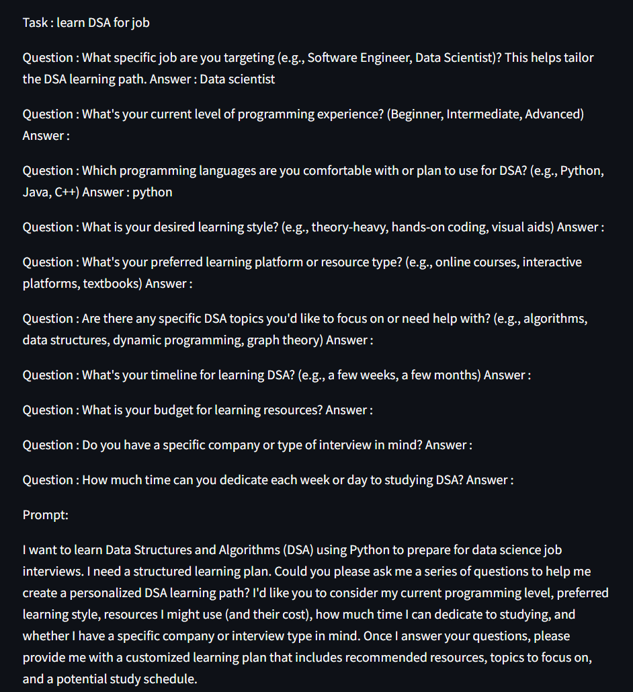

# Learn AI: A Prompt Engineering Web App

Learn AI is a sophisticated web application designed to help users master the art of crafting effective prompts for AI chatbots. 
Built with cutting-edge technologies like the Streamlit library and the Gemini API, this app not only facilitates prompt creation 
but also aids in refining and learning through an intuitive interface.

---

## Contents
- [Features](#features)
- [Technologies Used](#technologies-used)
- [Installation](#installation)
- [Usage](#usage)
- [Live Models](#live-models)
- [Screenshots](#screenshots)
- [Contributing](#contributing)
- [License](#license)
- [Contact](#contact)

---

## Features
- **Prompt Management**: Effortlessly store and manage both rough and refined prompts for learning and reference.
- **AI-Driven Refinement**: Leverage the power of AI to transform basic prompts into highly effective ones.
- **Educational Insights**: Compare original and optimized prompts to gain valuable insights into effective prompt engineering.
- **User-Centric Design**: Experience a seamless and intuitive user interface powered by Streamlit.

---

## Technologies Used
- **Streamlit**: For an interactive and user-friendly web application.
- **Gemini API**: To enable AI-driven prompt refinement and engagement.
- **MongoDB**: For reliable and efficient data storage and retrieval.

---

## Installation
To get started with Learn AI, follow these steps:

1. Clone the repository:
   ```bash
   git clone <repository_url>
   ```
2. Navigate to the project directory:
   ```bash
   cd learn-ai
   ```
3. Install the required dependencies:
   ```bash
   pip install -r requirements.txt
   ```
4. Launch the application:
   ```bash
   streamlit run app.py
   ```

---

## Usage
1. Open the web application in your preferred browser.
2. Register an account if you are a new user.
3. Log in to access the app's features.
4. Input a rough prompt into the designated input field.
5. Respond to AI-generated questions to refine your prompt.
6. Receive a polished, AI-optimized prompt tailored to your needs.
7. Save and revisit both rough and refined prompts for continuous learning.

---

## Live Models
Explore the live versions of our projects:
- **Learn AI Web App**: [https://ajs-learn-ai.streamlit.app/](https://ajs-learn-ai.streamlit.app/)
- **Other Projects**: [https://linktr.ee/joyboy0599](https://linktr.ee/joyboy0599)

---

## Screenshots
Enhance your understanding with visual previews:
- 

- 

- 

- 

- 

- 

---

## Contributing
We welcome contributions from the community! Follow these steps to contribute:

1. Fork the repository.
2. Create a dedicated branch for your feature:
   ```bash
   git checkout -b feature-name
   ```
3. Document your changes with a clear commit message:
   ```bash
   git commit -m "Add feature description"
   ```
4. Push the changes to your branch:
   ```bash
   git push origin feature-name
   ```
5. Submit a pull request for review.

---

## License
This project is licensed under the Apache License 2.0. For more details, refer to the [LICENSE](LICENSE/) file.

---

## Contact
Have questions or feedback? Feel free to connect:
- **LinkedIn**: [AyushJainSparsh](http://www.linkedin.com/in/ayushjainsparsh)

---

Thank you for choosing Learn AI. We are committed to helping you create exceptional prompts and elevate your AI interactions.

---